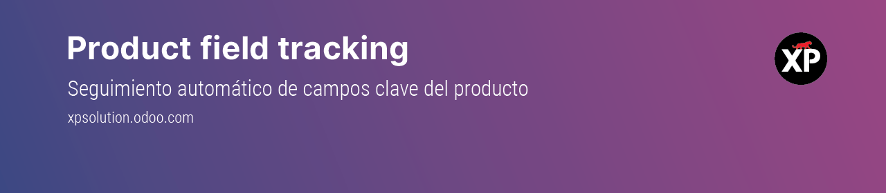

Product Field Tracking
=======================

Creado por XP Solution - https://xpsolution.odoo.com  
Versión: Odoo Enterprise 16.0

Este módulo registra automáticamente en el *chatter* del producto los cambios realizados en ciertos campos clave, sin necesidad de activar el seguimiento manual en cada uno.

Funcionalidades
----------------

- Registro automático en el chatter de cambios en campos clave.
- Configuración de seguimiento desde Ajustes generales del sistema.
- Indicación de usuario, campo editado, valor anterior y nuevo.

Campos monitoreados
--------------------

Puedes activar o desactivar el seguimiento desde el menú de Ajustes → General → **Configuración de seguimiento de campos de producto**:

- Nombre (``name``)
- Referencia interna (``default_code``)
- Precio de venta (``list_price``)
- Costo (``standard_price``)
- Código de barras (``barcode``)

Ejemplo del mensaje generado
-----------------------------

::

    Cambio registrado por: admin - 28/06/2025 17:36

    Nombre cambió de 'Producto A' a **Producto B**
    Precio de venta cambió de '10.00' a **12.00**
    Código de barras cambió de '123456789' a **123456789-T**

Requisitos
-----------

- Odoo Enterprise 16.0
- Hospedado en Odoo.sh
- Módulos ``product`` y ``mail`` instalados

Captura de pantalla
--------------------

